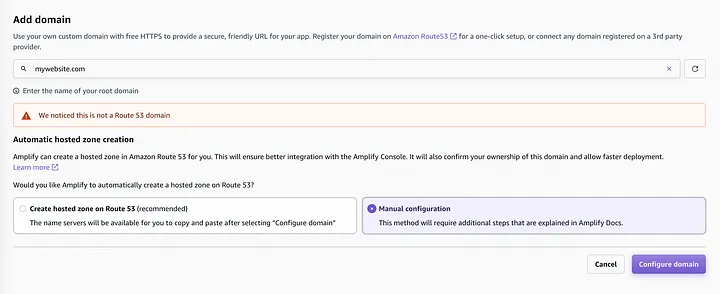
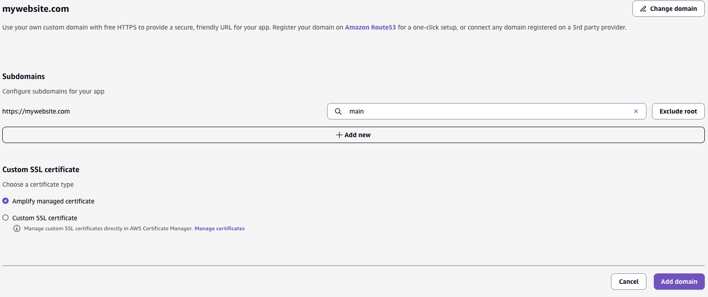
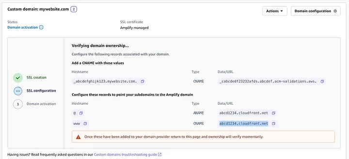
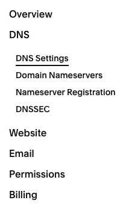

# How to set up a Squarespace Domain on AWS Amplify (2025)

I am writing this tutorial because the ones I have found online have not been accurate as of 4/22/25.
Here are the steps:

1. In your Amplify console, navigate to the `Custom domains` section
2. Click on `Add a domain`, enter in your domain, and choose `Manual configuration`
   
3. Removing the `www` subdomain from this list ended up working for me, although your mileage may vary:
   
4. AWS will take a minute or two to set up your SSL certificate, once its completed, you will see something similar to the following:
   
5. In your Squarespace domain settings, navigate to `DNS > DNS Settings`

   

6. Delete the Squarespace defaults
7. Add two custom records:
   1. first
      1. host = { copy the topmost hostname from Amplify console, make sure to remove the '.' at the end }
      2. type = CNAME
      3. TTL = 1hr (can use what you want)
      4. data = { copy the topmost data/url link from Amplify console, also make sure to remove any leading or trailing '.'s }
   2. second
      1. host = @
      2. type = ALIAS
      3. TTL = 1hr (can use what you want)
      4. data = { copy from Amplify console, make sure there are no leading or trailing '.'s | ex. abcdefg1234.cloudfront.net }
8. Give AWS a few minutes to refresh and you should then see your domain has been linked successfully. This only took me about 15 minutes, so if it takes longer than that for you I would retry.

 
 
If this helped you out please give it a ⭐!
